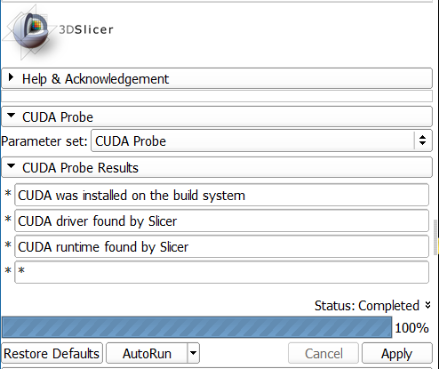

# Slicer-CUDAProbe
Slicer-CUDAProbe is a 3D Slicer extension that checks
both your Slicer build and your computer configuration
for CUDA capability.

The following tests are performed:

1. CUDA was installed on the Slicer build computer
1. NVIDIA display driver installed locally
1. CUDA libraries installed locally
1. A CUDA-capable GPU is installed

An example of the CUDA Probe utility is shown below.

